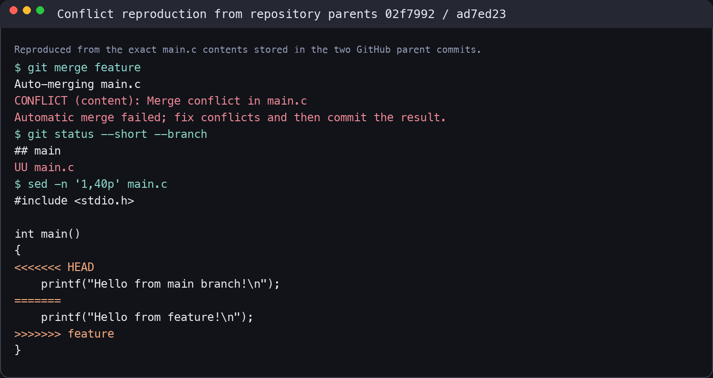
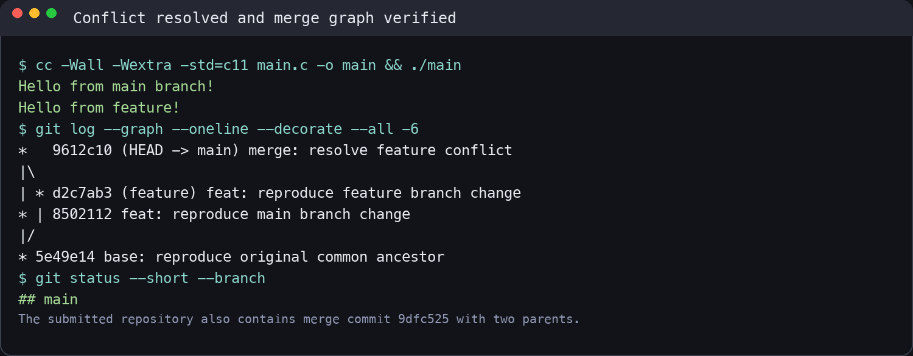

# Lab0：GitLab 实验报告

姓名：Jack Li  
日期：2026-09-14

## 一、思考题

### 1. 你是否有和同学合作完成任务的经历？如何协作？

有。在课程小组作业中，我们通常先拆分任务，再通过共享文档和即时通讯同步进度；代码部分使用 GitHub 仓库协作，每个人在独立分支开发，完成后提交 commit，并通过代码审查和合并统一成果。遇到冲突时，先确认双方修改目的，再共同决定保留或整合哪些内容。

### 2. 为什么 Git 要区分暂存（stage）和提交（commit）？

工作区保存正在修改的内容，暂存区用于挑选“本次准备提交”的改动，提交区则形成不可变的版本记录。区分暂存和提交可以把一次混杂的修改拆成多个逻辑清晰的 commit，也方便提交前检查内容，避免把调试代码、临时文件或无关修改一起提交。

### 3. `git branch` 与 `git branch -a` 的区别

`git branch` 只显示本地分支；`git branch -a` 除本地分支外，还会显示远程跟踪分支，例如 `remotes/origin/main`。因此需要查看仓库全部本地和远程分支时，应使用 `git branch -a`。

## 二、基础 Git 操作

1. 从课程提供的模板创建并克隆仓库。
2. 修改 `main.c`，完成 TODO，并提交 `feat: complete main program TODO`。
3. 查看提交历史和分支图，确认提交已记录。

## 三、参考资料阅读

### 1. Commit Message 规范

规范的提交信息通常采用“类型 + 简短说明”的格式，例如 `feat`、`fix`、`docs`、`refactor`。清晰的 commit message 能让协作者快速理解修改目的，便于生成 Change Log、定位问题、回退版本和关联 Issue。

### 2. Git 分支模型

分支是指向某次提交的轻量指针。开发新功能时在独立分支完成，可以避免影响稳定的主分支。功能完成并验证后，再合并回 `main`。分支模型能够支持多人并行开发、代码审查和版本发布，也使实验性的修改更容易隔离和撤销。

### 3. 为什么要学习 Git

Git 不只是备份代码的工具，更是管理软件演化过程的工具。它可以保存可追溯的修改历史，让开发者安全地试验、比较和回退；在多人协作中，Git 提供统一的合并机制和责任记录。掌握 Git 是进行课程实验、团队项目和开源协作的基础能力。

## 四、分支、冲突与合并实验

1. 从共同祖先创建 `feature` 分支。
2. 在 `feature` 分支修改 `main.c` 的输出语句并提交。
3. 切回 `main`，修改同一位置并提交。
4. 在 `main` 上合并 `feature`，Git 报告 `CONFLICT (content): Merge conflict in main.c`。
5. VS Code 中出现 `<<<<<<< HEAD`、`=======` 和 `>>>>>>> feature` 冲突标记，分别表示当前分支内容和传入分支内容。
6. 解决时保留双方有意义的输出，删除冲突标记，加入 `return 0;`，将文件暂存并完成合并。

### 冲突出现时的记录

```text
CONFLICT (content): Merge conflict in main.c
Automatic merge failed; fix conflicts and then commit the result.
```

原操作过程中没有及时保存截图。为保证记录可核验，下面使用仓库中合并提交 `9dfc525` 的两个真实父提交重新执行相同合并：主分支父提交为 `02f7992`，功能分支父提交为 `ad7ed23`。复现时读取的是这两个提交中实际保存的 `main.c` 内容，Git 再次产生相同的内容冲突。



### 解决冲突并验证

删除冲突标记后，同时保留两个分支的输出并加入 `return 0;`。随后使用 `-Wall -Wextra -std=c11` 编译，程序正常输出两行文字；提交图显示两个分支汇入同一个合并提交。



### 解决后的 `main.c`

```c
#include <stdio.h>

int main()
{
    printf("Hello from main branch!\n");
    printf("Hello from feature!\n");
    return 0;
}
```

## 五、实验结果与总结

本实验完成了仓库克隆、文件修改、暂存、提交、分支创建、分支切换、冲突制造、冲突解决和分支合并。通过实际操作，我理解了 Git 的三个区域、分支的轻量特性，以及冲突产生的原因：两个分支修改了共同祖先之后的同一段内容，Git 无法自动判断应保留哪一版。解决冲突时需要人工理解修改意图，再形成最终版本并提交。

最终 `main` 分支包含基础功能提交、主分支修改、`feature` 分支修改、双父合并提交和修正后的 `main.c`，实验报告及冲突截图也纳入版本管理。

## 六、建议

建议在实验说明中增加一份简明任务清单，方便完成实验后逐项核对，同时保留现有长文档用于概念解释和扩展阅读。
